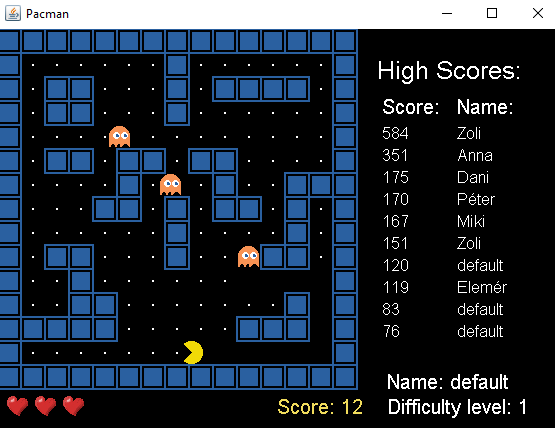

# Pacman
 
## Leírás

A klasszikus pacman játék általam készített vrziója. A játékban egy sárga figurát egy labirintusban irányít a játékos, ahol pontok megevésével növelheti a pontszámát. A cél minél több pont felszedése, viszont ebben a feladatban ellenséges szellemek a játékost akadályozzák. Ha a
játékos szellemmel ütközik, csökken az élete, bizonyos számú ütközés után vége a játéknak.

